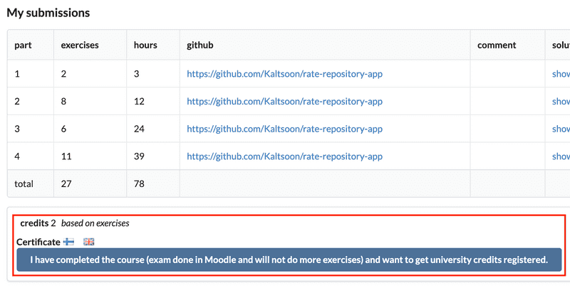

In this part, we will learn how to package code into standard units of software called containers. These containers can help us develop software faster and easier than before. Along the way, we will also explore a completely new viewpoint for web development, outside of the now-familiar Node.js backend and React frontend.

We will utilize containers to create immutable execution environments for our Node.js and React projects. Containers also make it easy to include multiple services with our projects. With their flexibility, we will explore and experiment with many different and popular tools by utilizing containers.

This section has been created by Jami Kousa in collaboration with the Helsinki-based Services Foundation team at Unity. The Services Foundation team works on providing platforms for other teams at Unity to succeed in their mission of building great services for their customers. The team is passionate about improving Unity’s developer experience and works on tools like the Unity Dashboard, the Unity Editor, and [Unity.com](https://unity.com/).

# Table of Content

# Part 12

## Part 12a - Introduction to Containers

Software development includes the whole lifecycle from envisioning the software to programming and to releasing it to the end-users, and even maintaining it. This part will introduce containers, a modern tool utilized in the latter parts of the software lifecycle.

Containers encapsulate your application into a single package. This package will include the application and all of its dependencies. As a result, each container can run isolated from the other containers.

Containers prevent the application inside from accessing files and resources of the device. Developers can give the contained applications permission to access files and specify available resources. More accurately, containers are OS-level virtualization. The easiest-to-compare technology is a virtual machine (VM). VMs are used to run multiple operating systems on a single physical machine. They have to run the whole operating system, whereas a container runs the software using the host operating system. The resulting difference between VMs and containers is that there is hardly any overhead when running containers; they only need to run a single process.

As containers are relatively lightweight, at least compared to virtual machines, they can be quick to scale. And as they isolate the software running inside, it enables the software to run identically almost anywhere. As such, they are the go-to option in any cloud environment or application with more than a handful of users.

Cloud services like AWS, Google Cloud, and Microsoft Azure all support containers in multiple different forms. These include AWS Fargate and Google Cloud Run, both of which run containers as serverless - where the application container does not even need to be running if it is not used. You can also install container runtime on most machines and run containers there yourself - including your own machine.

So containers are used in cloud environment and even during development. What are the benefits of using containers? Here are two common scenarios:

*Scenario 1: You are developing a new application that needs to run on the same machine as a legacy application. Both require installing different versions of Node.*

You can probably use nvm, virtual machines, or dark magic to get them running at the same time. However, containers are an excellent solution as you can run both applications in their respective containers. They are isolated from each other and do not interfere.

*Scenario 2: Your application runs on your machine. You need to move the application to a server.*

It is not uncommon that the application just does not run on the server despite it works just fine on your machine. It may be due to some missing dependency or other differences in the environments. Here containers are an excellent solution since you can run the application in the same execution environment both on your machine and on the server. It is not perfect: different hardware can be an issue, but you can limit the differences between environments.

Sometimes you may hear about the "*Works in my container*" issue. The phrase describes a situation in which the application works fine in a container running on your machine but breaks when the container is started on a server. The phrase is a play on the infamous "*Works on my machine*" issue, which containers are often promised to solve. The situation also is most likely a usage error.

### About this part

In this part, the focus of our attention will not be on the JavaScript code. Instead, we are interested in the configuration of the environment in which the software is executed. As a result, the exercises may not contain any coding, the applications are available to you through GitHub and your tasks will include configuring them. The exercises are to be submitted to a single GitHub repository which will include all of the source code and the configurations that you do during this part.

You will need basic knowledge of Node, Express, and React. Only the core parts, 1 through 5, are required to be completed before this part. 

<hr style="border: 2px solid #FAB9D3">

### Exercise 12.1

#### *Warning*

Since we are stepping right outside of our comfort zone as JavaScript developers, this part may require you to take a detour and familiarize yourself with shell / command line / command prompt / terminal before getting started.

If you have only ever used a graphical user interface and never touched e.g. Linux or terminal on Mac, or if you get stuck in the first exercises we recommend doing the Part 1 of "Computing tools for CS studies" first: https://tkt-lapio.github.io/en/. Skip the section for "SSH connection" and Exercise 11. Otherwise, it includes everything you are going to need to get started here!

#### 12.1: Using a computer (without graphical user interface)

Step 1: Read the text below the "Warning" header.

Step 2: Download this [repository](https://github.com/fullstack-hy2020/part12-containers-applications) and make it your submission repository for this part.

Step 3: Run curl http://helsinki.fi and save the output into a file. Save that file into your repository as file *script-answers/exercise12_1.txt*. The directory *script-answers* was created in the previous step.

<hr style="border: 2px solid #FAB9D3">

### Submitting exercises and earning credits

Submit the exercises via the [submissions system](https://studies.cs.helsinki.fi/stats/) just like in the previous parts. Exercises in this part are submitted *to its [own course instance](https://studies.cs.helsinki.fi/stats/courses/fs-containers)*.

Completing this part on containers will get you 1 credit. Note that you need to do all the exercises for earning the credit or the certificate.

Once you have completed the exercises and want to get the credits, let us know through the exercise submission system that you have completed the course:



You can download the certificate for completing this part by clicking one of the flag icons. The flag icon corresponds to the language of the certificate.

### Tools of the trade

The basic tools you are going to need vary between operating systems:

- WSL 2 terminal on Windows

- Terminal on Mac

- Command Line on a Linux

### Installing everything required for this part

We will begin by installing the required software. The installation step will be one of the possible obstacles. As we are dealing with OS-level virtualization, the tools will require superuser access on the computer. They will have access to your operating systems kernel.

The material is built around [Docker](https://www.docker.com/), a set of products that we will use for containerization and the management of containers. Unfortunately, if you can not install Docker you probably can not complete this part.

As the install instructions depend on your operating system, you will have to find the correct install instructions from the link below. Note that they may have multiple different options for your operating system.

- [Get Docker](https://docs.docker.com/get-docker/)

Now that that headache is hopefully over, let's make sure that our versions match. Yours may have a bit higher numbers than here:

```bash
$ docker -v
Docker version 25.0.3, build 4debf41
```