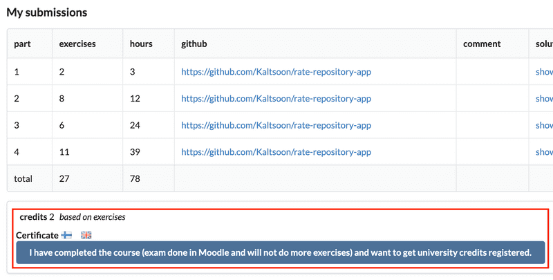

In this part, we will learn how to package code into standard units of software called containers. These containers can help us develop software faster and easier than before. Along the way, we will also explore a completely new viewpoint for web development, outside of the now-familiar Node.js backend and React frontend.

We will utilize containers to create immutable execution environments for our Node.js and React projects. Containers also make it easy to include multiple services with our projects. With their flexibility, we will explore and experiment with many different and popular tools by utilizing containers.

This section has been created by Jami Kousa in collaboration with the Helsinki-based Services Foundation team at Unity. The Services Foundation team works on providing platforms for other teams at Unity to succeed in their mission of building great services for their customers. The team is passionate about improving Unity’s developer experience and works on tools like the Unity Dashboard, the Unity Editor, and [Unity.com](https://unity.com/).

# Table of Content

# Part 12

## Part 12a - Introduction to Containers

Software development includes the whole lifecycle from envisioning the software to programming and to releasing it to the end-users, and even maintaining it. This part will introduce containers, a modern tool utilized in the latter parts of the software lifecycle.

Containers encapsulate your application into a single package. This package will include the application and all of its dependencies. As a result, each container can run isolated from the other containers.

Containers prevent the application inside from accessing files and resources of the device. Developers can give the contained applications permission to access files and specify available resources. More accurately, containers are OS-level virtualization. The easiest-to-compare technology is a virtual machine (VM). VMs are used to run multiple operating systems on a single physical machine. They have to run the whole operating system, whereas a container runs the software using the host operating system. The resulting difference between VMs and containers is that there is hardly any overhead when running containers; they only need to run a single process.

As containers are relatively lightweight, at least compared to virtual machines, they can be quick to scale. And as they isolate the software running inside, it enables the software to run identically almost anywhere. As such, they are the go-to option in any cloud environment or application with more than a handful of users.

Cloud services like AWS, Google Cloud, and Microsoft Azure all support containers in multiple different forms. These include AWS Fargate and Google Cloud Run, both of which run containers as serverless - where the application container does not even need to be running if it is not used. You can also install container runtime on most machines and run containers there yourself - including your own machine.

So containers are used in cloud environment and even during development. What are the benefits of using containers? Here are two common scenarios:

*Scenario 1: You are developing a new application that needs to run on the same machine as a legacy application. Both require installing different versions of Node.*

You can probably use nvm, virtual machines, or dark magic to get them running at the same time. However, containers are an excellent solution as you can run both applications in their respective containers. They are isolated from each other and do not interfere.

*Scenario 2: Your application runs on your machine. You need to move the application to a server.*

It is not uncommon that the application just does not run on the server despite it works just fine on your machine. It may be due to some missing dependency or other differences in the environments. Here containers are an excellent solution since you can run the application in the same execution environment both on your machine and on the server. It is not perfect: different hardware can be an issue, but you can limit the differences between environments.

Sometimes you may hear about the "*Works in my container*" issue. The phrase describes a situation in which the application works fine in a container running on your machine but breaks when the container is started on a server. The phrase is a play on the infamous "*Works on my machine*" issue, which containers are often promised to solve. The situation also is most likely a usage error.

### About this part

In this part, the focus of our attention will not be on the JavaScript code. Instead, we are interested in the configuration of the environment in which the software is executed. As a result, the exercises may not contain any coding, the applications are available to you through GitHub and your tasks will include configuring them. The exercises are to be submitted to a single GitHub repository which will include all of the source code and the configurations that you do during this part.

You will need basic knowledge of Node, Express, and React. Only the core parts, 1 through 5, are required to be completed before this part. 

<hr style="border: 2px solid #FAB9D3">

### Exercise 12.1

#### *Warning*

Since we are stepping right outside of our comfort zone as JavaScript developers, this part may require you to take a detour and familiarize yourself with shell / command line / command prompt / terminal before getting started.

If you have only ever used a graphical user interface and never touched e.g. Linux or terminal on Mac, or if you get stuck in the first exercises we recommend doing the Part 1 of "Computing tools for CS studies" first: https://tkt-lapio.github.io/en/. Skip the section for "SSH connection" and Exercise 11. Otherwise, it includes everything you are going to need to get started here!

#### 12.1: Using a computer (without graphical user interface)

Step 1: Read the text below the "Warning" header.

Step 2: Download this [repository](https://github.com/fullstack-hy2020/part12-containers-applications) and make it your submission repository for this part.

Step 3: Run curl http://helsinki.fi and save the output into a file. Save that file into your repository as file *script-answers/exercise12_1.txt*. The directory *script-answers* was created in the previous step.

<hr style="border: 2px solid #FAB9D3">

### Submitting exercises and earning credits

Submit the exercises via the [submissions system](https://studies.cs.helsinki.fi/stats/) just like in the previous parts. Exercises in this part are submitted *to its [own course instance](https://studies.cs.helsinki.fi/stats/courses/fs-containers)*.

Completing this part on containers will get you 1 credit. Note that you need to do all the exercises for earning the credit or the certificate.

Once you have completed the exercises and want to get the credits, let us know through the exercise submission system that you have completed the course:



You can download the certificate for completing this part by clicking one of the flag icons. The flag icon corresponds to the language of the certificate.

### Tools of the trade

The basic tools you are going to need vary between operating systems:

- WSL 2 terminal on Windows

- Terminal on Mac

- Command Line on a Linux

### Installing everything required for this part

We will begin by installing the required software. The installation step will be one of the possible obstacles. As we are dealing with OS-level virtualization, the tools will require superuser access on the computer. They will have access to your operating systems kernel.

The material is built around [Docker](https://www.docker.com/), a set of products that we will use for containerization and the management of containers. Unfortunately, if you can not install Docker you probably can not complete this part.

As the install instructions depend on your operating system, you will have to find the correct install instructions from the link below. Note that they may have multiple different options for your operating system.

- [Get Docker](https://docs.docker.com/get-docker/)

Now that that headache is hopefully over, let's make sure that our versions match. Yours may have a bit higher numbers than here:

```bash
$ docker -v
Docker version 25.0.3, build 4debf41
```

### Containers and images

There are two core concepts in this part: *container* and *image*. They are easy to confuse with one another.

A *container* is a runtime instance of an *image*.

Both of the following statements are true:

- Images include all of the code, dependencies and instructions on how to run the application

- Container package software into standardized units

It is no wonder they are easily mixed up.

To help with the confusion, almost everyone uses the word container to describe both. But you can never actually build a container or download one since containers only exist during runtime. Images, on the other hand, are **immutable** files. As a result of the immutability, you can not edit an image after you have created one. However, you can use existing images to create a *new image* by adding new layers on top of the existing ones.

Cooking metaphor:

- Image is pre-cooked, frozen treat.

- Container is the delicious treat.

[Docker](https://www.docker.com/) is the most popular containerization technology and pioneered the standards most containerization technologies use today. In practice, Docker is a set of products that help us to manage images and containers. This set of products will enable us to leverage all of the benefits of containers. For example, the Docker engine will take care of turning the immutable files called images into containers.

For managing the Docker containers, there is also a tool called [Docker Compose](https://docs.docker.com/compose/) that allows one to **orchestrate** (control) multiple containers at the same time. In this part we shall use Docker Compose to set up a complex local development environment. In the final version of the development environment that we will set up, even installing Node in our machine will not be required anymore.

There are several concepts we need to go over. But we will skip those for now and learn about Docker first!

Let us start with the command *docker container run* that is used to run images within a container. The command structure is the following: `container run IMAGE-NAME` that we will tell Docker to create a container from an image. A particularly nice feature of the command is that it can run a container even if the image to run is not downloaded on our device yet.

Let us run the command

```bash
$ docker container run hello-world
```

There will be a lot of output, but let's split it into multiple sections, which we can decipher together. The lines are numbered by me so that it is easier to follow the explanation. Your output will not have the numbers.

```bash
1. Unable to find image 'hello-world:latest' locally
2. latest: Pulling from library/hello-world
3. b8dfde127a29: Pull complete
4. Digest: sha256:5122f6204b6a3596e048758cabba3c46b1c937a46b5be6225b835d091b90e46c
5. Status: Downloaded newer image for hello-world:latest
```

Because the image *hello-world* was not found on our machine, the command first downloaded it from a free registry called [Docker Hub](https://hub.docker.com/). You can see the Docker Hub page of the image with your browser here: https://hub.docker.com/_/hello-world

The first part of the message states that we did not have the image "hello-world:latest" yet. This reveals a bit of detail about images themselves; image names consist of multiple parts, kind of like an URL. An image name is in the following format:

- `registry/organisation/image:tag`

In this case the 3 missing fields defaulted to:

- `index.docker.io/library/hello-world:latest`

The second row shows the organisation name, "library" where it will get the image. In the Docker Hub URL, the "library" is shortened to _.

The 3rd and 5th rows only show the status. But the 4th row may be interesting: each image has a unique digest based on the *layers* from which the image is built. In practice, each step or command that was used in building the image creates a unique layer. The digest is used by Docker to identify that an image is the same. This is done when you try to pull the same image again.

So the result of using the command was a pull and then output information about the **image**. After that, the status told us that a new version of *hello-world:latest* was indeed downloaded. You can try pulling the image with` docker image pull hello-world` and see what happens.

The following output was from the container itself. It also explains what happened when we ran `docker container run hello-world`.

```bash
Hello from Docker!
This message shows that your installation appears to be working correctly.

To generate this message, Docker took the following steps:
 1. The Docker client contacted the Docker daemon.
 2. The Docker daemon pulled the "hello-world" image from the Docker Hub.
    (amd64)
 3. The Docker daemon created a new container from that image which runs the
    executable that produces the output you are currently reading.
 4. The Docker daemon streamed that output to the Docker client, which sent it
    to your terminal.

To try something more ambitious, you can run an Ubuntu container with:
 $ docker container run -it ubuntu bash

Share images, automate workflows, and more with a free Docker ID:
 https://hub.docker.com/

For more examples and ideas, visit:
 https://docs.docker.com/get-started/
```

The output contains a few new things for us to learn. Docker daemon is a background service that makes sure the containers are running, and we use the Docker client to interact with the daemon. We now have interacted with the first image and created a container from the image. During the execution of that container, we received the output.

<hr style="border: 2px solid #FAB9D3">

### Exercise 12.2

Some of these exercises do not require you to write any code or configurations to a file. In these exercises you should use the [script](https://man7.org/linux/man-pages/man1/script.1.html) command to record the commands you have used try it yourself with `script` to start recording, `echo "hello"` to generate some output, and `exit` to stop recording. It saves your actions into a file name "typescript" (that has nothing to do with the TypeScript programming language, the name is just a coincidence).

If `script` does not work, you can just copy-paste all commands you used into a text file.

#### Exercise 12.2: running you second container

> Use `script` to record what you do, save the file as script=answers/exercise12_2.txt

The hello-world output gave use an ambitious task to do. Do the following:

- Step 1. Run an Ubuntu container with the command given by hello-world

The step 1 will connect you straight into the container with bash. You will have access to all of the files and tools inside of the container. The following steps are run within the container:

- Step 2. Create directory */usr/src/app*

- Step 3. Create a file */usr/src/app/index.js*

- Step 4. Run *exit* to quit from the container

Google should be able to help you with creating directories and files.

<hr style="border: 2px solid #FAB9D3">

### Ubuntu image

The command you just used to run the Ubuntu container, `docker container run -it ubuntu bash`, contains a few additions to the previously run hello-world. Let's see the --help to get a better understanding. I'll cut some of the output so we can focus on the relevant parts.

```bash
$ docker container run --help

Usage:  docker container run [OPTIONS] IMAGE [COMMAND] [ARG...]
Run a command in a new container

Options:
  ...
  -i, --interactive                    Keep STDIN open even if not attached
  -t, --tty                            Allocate a pseudo-TTY
  ...
```

The two options, or flags, `-it` make sure we can interact with the container. After the options, we defined that the image to run is `ubuntu`. Then we have the command `bash` to be executed inside the container when we start it.

You can try other commands that the Ubuntu image might be able to execute. As an example try `docker container run --rm ubuntu ls`. The `ls` command will list all of the files in the directory and `--rm` flag will remove the container after execution. Normally containers are not deleted automatically.

Let's continue with our first Ubuntu container with the **index.js** file inside of it. The container has stopped running since we exited it. We can list all of the containers with `container ls -a`, the `-a` (or --all) will list containers that have already been exited.

```bash
$ docker container ls -a
CONTAINER ID   IMAGE     COMMAND   CREATED          STATUS                            NAMES
b8548b9faec3   ubuntu    "bash"    3 minutes ago    Exited (0) 6 seconds ago          hopeful_clarke
```

> *Editor's note: the command* `docker container ls` *has also a shorter form* `docker ps`.

We have two options when addressing a container. The identifier in the first column can be used to interact with the container almost always. Plus, most commands accept the container name as a more human-friendly method of working with them. The name of the container was automatically generated to be **"hopeful_clarke"** in my case.

The container has already exited, yet we can start it again with the start command that will accept the id or name of the container as a parameter: `start CONTAINER-ID-OR-CONTAINER-NAME`.

```bash
$ docker start hopeful_clarke
hopeful_clarke
```

The start command will start the same container we had previously. Unfortunately, we forgot to start it with the flag `--interactive` (that can also be written `-i`) so we can not interact with it.

The container is actually up and running as the command `container ls -a` shows, but we just can not communicate with it:

```bash
$ docker container ls -a
CONTAINER ID   IMAGE     COMMAND   CREATED          STATUS                            NAMES
b8548b9faec3   ubuntu    "bash"    7 minutes ago    Up (0) 15 seconds ago            hopeful_clarke
```

Note that we can also execute the command without the flag `-a` to see just those containers that are running:

```bash
$ docker container ls
CONTAINER ID   IMAGE     COMMAND   CREATED          STATUS             NAMES
8f5abc55242a   ubuntu    "bash"    8 minutes ago    Up 1 minutes       hopeful_clarke             
```

Let's kill it with the `kill CONTAINER-ID-OR-CONTAINER-NAME` command and try again.

```bash
$ docker kill hopeful_clarke
hopeful_clarke
```

`docker kill` sends a [signal SIGKILL](https://man7.org/linux/man-pages/man7/signal.7.html) to the process forcing it to exit, and that causes the container to stop. We can check it's status with `container ls -a`:

```bash
$ docker container ls -a
CONTAINER ID   IMAGE     COMMAND   CREATED             STATUS                     NAMES
b8548b9faec3   ubuntu     "bash"   26 minutes ago      Exited 2 seconds ago       hopeful_clarke
```

Now let us start the container again, but this time in interactive mode:

```bash
$ docker start -i hopeful_clarke
root@b8548b9faec3:/#
```

Let's edit the file *index.js* and add in some JavaScript code to execute. We are just missing the tools to edit the file. [Nano](https://www.nano-editor.org/) will be a good text editor for now. The install instructions were found from the first result of Google. We will omit using sudo since we are already root.

```bash
root@b8548b9faec3:/# apt-get update
root@b8548b9faec3:/# apt-get -y install nano
root@b8548b9faec3:/# nano /usr/src/app/index.js
```

Now we have Nano installed and can start editing files!

<hr style="border: 2px solid #FAB9D3">

### Exercise 12.3 - 12.4

#### Exercise 12.3: Ubuntu 101

> Use `script` to record what you do, save the file as script-answers/exercise12_3.txt

Edit the `/usr/src/app/index.js` file inside the container with the now installed Nano and add the following line

```js
console.log("Hello world")
```

If you are not familiar with Nano you can ask for help in the chat or Google.

#### Exercise 12.4: Ubuntu 102

> Use `script` to record what you do, save the file as script-answers/exercise12_4.txt

Install Node while inside the container and run the index file with node `/usr/src/app/index.js` in the container.

The instructions for installing Node are sometimes hard to find, so here is something you can copy-paste:

```bash
curl -sL https://deb.nodesource.com/setup_20.x | bash
apt install -y nodejs
```

You will need to install the `curl` into the container. It is installed in the same way as you did with `nano`.

After the installation, ensure that you can run your code inside the container with the command:

```bash
root@b8548b9faec3:/# node /usr/src/app/index.js
Hello World
```

<hr style="border: 2px solid #FAB9D3">

### Other Docker commands

Now that we have Node installed in the container, we can execute JavaScript in the container! Let's create a new image from the container. The command

```bash
commit CONTAINER-ID-OR-CONTAINER-NAME NEW-IMAGE-NAME
```

will create a new image that includes the changes we have made. You can use `container diff` to check for the changes between the original image and container before doing so.

```bash
$ docker commit hopeful_clarke hello-node-world
```

You can list your images with `image ls`:

```bash
$ docker image ls
REPOSITORY                                      TAG         IMAGE ID       CREATED         SIZE
hello-node-world                                latest      eef776183732   9 minutes ago   252MB
ubuntu                                          latest      1318b700e415   2 weeks ago     72.8MB
hello-world                                     latest      d1165f221234   5 months ago    13.3kB
```

You can now run the new image as follows:

```bash
docker run -it hello-node-world bash
root@4d1b322e1aff:/# node /usr/src/app/index.js
```

There are multiple ways to do the same. Let's try a better solution. We will clean the slate with `container rm` to remove the old container.

```bash
$ docker container ls -a
CONTAINER ID   IMAGE     COMMAND   CREATED          STATUS                  NAMES
b8548b9faec3   ubuntu    "bash"    31 minutes ago   Exited (0) 9 seconds ago               hopeful_clarke

$ docker container rm hopeful_clarke
hopeful_clarke
```

Create a file *index.js* to your current directory and write `console.log('Hello, World')` inside it. No need for containers yet.

Next, let's skip installing Node altogether. There are plenty of useful Docker images in Docker Hub ready for our use. Let's use the image https://hub.docker.com/_/node, which has Node already installed. We only need to pick a version.

By the way, the `container run` accepts `--name` flag that we can use to give a name for the container.

```bash
$ docker container run -it --name hello-node node:20 bash
```

Let us create a directory for the code inside the container:

```bash
root@77d1023af893:/# mkdir /usr/src/app
```

While we are inside the container on this terminal, open another terminal and use the `container cp` command to copy file from your own machine to the container.

```bash
$ docker container cp ./index.js hello-node:/usr/src/app/index.js
```

And now we can run `node /usr/src/app/index.js` in the container. We can commit this as another new image, but there is an even better solution. The next section will be all about building your images like a pro.

## Part 12b - Building and configuring environments

In the previous section, we used two different base images: ubuntu and node, and did some manual work to get a simple "Hello, World!" running. The tools and commands we learned during that process will be helpful. In this section, we will learn how to build images and configure environments for our applications. We will start with a regular Express/Node.js backend and build on top of that with other services, including a MongoDB database.

### Dockerfile

Instead of modifying a container by copying files inside, we can create a new image that contains the "Hello, World!" application. The tool for this is the Dockerfile. Dockerfile is a simple text file that contains all of the instructions for creating an image. Let's create an example Dockerfile from the "Hello, World!" application.

If you did not already, create a directory on your machine and create a file called *Dockerfile* inside that directory. Let's also put an *index.js* containing `console.log('Hello, World!')` next to the Dockerfile. Your directory structure should look like this:

```bash
index.js
Dockerfile
```

inside that Dockerfile we will tell the image three things:

- Use the [node:20](https://hub.docker.com/_/node) as the base for our image

- Include the index.js file inside the image, so we don't need to manually copy it into the container

- When we run a container from the image, use Node to execute the index.js file.

The wishes above will translate into a basic Dockerfile. The best location to place this file is usually at the root of the project.

The resulting *Dockerfile* looks like this:

```dockerfile
FROM node:20

WORKDIR /usr/src/app

COPY ./index.js ./index.js

CMD node index.js
```

`FROM` instruction will tell Docker that the base for the image should be node:20. `COPY` instruction will copy the file *index.js* from the host machine to the file with the same name in the image. `CMD` instruction tells what happens when `docker run` is used. `CMD` is the default command that can then be overwritten with the argument given after the image name. 
See `docker run --help` if you forgot.

The `WORKDIR` instruction was slipped in to ensure we don't interfere with the contents of the image. It will guarantee all of the following commands will have */usr/src/app* set as the working directory. If the directory doesn't exist in the base image, it will be automatically created.

If we do not specify a `WORKDIR`, we risk overwriting important files by accident. If you check the root (`/`) of the node:20 image with `docker run node:20 ls`, you can notice all of the directories and files that are already included in the image.

Now we can use the command `docker build` to build an image based on the Dockerfile. Let's spice up the command with one additional flag: `-t`, this will help us name the image:

```bash
$ docker build -t fs-hello-world . 
[+] Building 3.9s (8/8) FINISHED
...
```

So the result is "Docker please build with tag (you may think of the tag as the name of the resulting image.) *fs-hello-world* the Dockerfile in this directory". You can point to any Dockerfile, but in our case, a simple dot will mean the Dockerfile is in *this* directory. That is why the command ends with a period. After the build is finished, you can run it with `docker run fs-hello-world`:

```bash
$ docker run fs-hello-world
Hello, World
```

As images are just files, they can be moved around, downloaded and deleted. You can list the images you have locally with `docker image ls`, delete them with `docker image rm`. See what other command you have available with `docker image --help`.

One more thing: before it was mentioned that the default command, defined by the CMD in the Dockerfile, can be overwritten if needed. We could e.g. open a bash session to the container and observe it's content:

```bash
$ docker run -it fs-hello-world bash
root@2932e32dbc09:/usr/src/app# ls
index.js
root@2932e32dbc09:/usr/src/app#
```

### More meaningful image

Moving an Express server to a container should be as simple as moving the "Hello, World!" application inside a container. The only difference is that there are more files. Thankfully `COPY` instruction can handle all that. Let's delete the index.js and create a new Express server. Lets use [express-generator](https://expressjs.com/en/starter/generator.html) to create a basic Express application skeleton.

```bash
$ npx express-generator
  ...
  
  install dependencies:
    $ npm install

  run the app:
    $ DEBUG=playground:* npm start
```

First, let's run the application to get an idea of what we just created. Note that the command to run the application may be different from you, my directory was called playground.

```bash
$ npm install
$ DEBUG=playground:* npm start
  playground:server Listening on port 3000 +0ms
```

Great, so now we can navigate to http://localhost:3000 and the app is running there.

Containerizing that should be relatively easy based on the previous example.

- Use node as base

- Set working directory so we don't interfere with the contents of the base image

- Copy ALL of the files in this directory to the image

- Start with DEBUG=playground:* npm start

Let's place the following Dockerfile at the root of the project:

```dockerfile
FROM node:20

WORKDIR /usr/src/app

COPY . .

CMD DEBUG=playground:* npm start
```

Let's build the image from the Dockerfile and then run it:

```bash
docker build -t express-server .
docker run -p 3123:3000 express-server
```

The `-p` flag in the run command will inform Docker that a port from the host machine should be opened and directed to a port in the container. The format is `-p host-port:application-port`.

The application is now running! Let's test it by sending a GET request to http://localhost:3123/.

> If yours doesn't work, skip to the next section. There is an explanation why it may not work even if you followed the steps correctly.

Shutting the app down is a headache at the moment. Use another terminal and `docker kill` command to kill the application. The `docker kill` will send a kill signal (SIGKILL) to the application to force it to shut down. It needs the name or the id of the container as an argument.

By the way, when using the id as the argument, the beginning of the ID is enough for Docker to know which container we mean.

```bash
$ docker container ls
  CONTAINER ID   IMAGE            COMMAND                  CREATED         STATUS         PORTS                                       NAMES
  48096ca3ffec   express-server   "docker-entrypoint.s…"   9 seconds ago   Up 6 seconds   0.0.0.0:3123->3000/tcp, :::3123->3000/tcp   infallible_booth

$ docker kill 48
  48
```

In the future, let's use the same port on both sides of `-p`. Just so we don't have to remember which one we happened to choose.

#### Fixing potential issues we created by copy-pasting 

There are a few steps we need to change to create a more comprehensive Dockerfile. It may even be that the above example doesn't work in all cases because we skipped an important step.

When we ran npm install on our machine, in some cases the **Node package manager** may install operating system specific dependencies during the install step. We may accidentally move non-functional parts to the image with the COPY instruction. This can easily happen if we copy the *node_modules* directory into the image.

This is a critical thing to keep in mind when we build our images. It's best to do most things, such as to run `npm install` during the build process *inside the container* rather than doing those prior to building. The easy rule of thumb is to only copy files that you would push to GitHub. Build artifacts or dependencies should not be copied since those can be installed during the build process.

We can use *.dockerignore* to solve the problem. The file .dockerignore is very similar to .gitignore, you can use that to prevent unwanted files from being copied to your image. The file should be placed next to the Dockerfile. Here is a possible content of a *.dockerignore*

```
.dockerignore
.gitignore
node_modules
Dockerfile
```

However, in our case, the .dockerignore isn't the only thing required. We will need to install the dependencies during the build step. The `Dockerfile` changes to:

```dockerfile
FROM node:20

WORKDIR /usr/src/app

COPY . . 

RUN nom install
CMD DEBUG=playground:* npm start
```

The npm install can be risky. Instead of using npm install, npm offers a much better tool for installing dependencies, the `ci` command.

Differences between `ci` and `install`:

- install may update the package-lock.json

- install may install a different version of a dependency if you have ^ or ~ in the version of the dependency.

- ci will delete the node_modules folder before installing anything

- ci will follow the package-lock.json and does not alter any files

So in short: `ci` creates reliable builds, while `install` is the one to use when you want to install new dependencies.

As we are not installing anything new during the build step, and we don't want the versions to suddenly change, we will use `ci`:

```dockerfile
FROM node:20

WORKDIR /usr/src/app

COPY . .

RUN npm ci
CMD DEBUG=playground:* npm start
```

Even better, we can use `npm ci --omit=dev` to not waste time installing development dependencies.

> As you noticed in the comparison list; npm ci will delete the node_modules folder so creating the .dockerignore did not matter. However, .dockerignore is an amazing tool when you want to optimize your build process. We will talk briefly about these optimizations later.

Now the Dockerfile should work again, try it with `docker build -t express-server . && docker run -p 3123:3000 express-server`

> Note that we are here chaining two bash commands with &&. We could get (nearly) the same effect by running both commands separately. When chaining commands with && if one command fails, the next ones in the chain will not be executed.

We set an environment variable `DEBUG=playground:*` during CMD for the npm start. However, with Dockerfiles we could also use the instruction ENV to set environment variables. Let's do that:

```dockerfile
FROM node:20

WORKDIR /usr/src/app

COPY . .

RUN npm ci

ENV DEBUG=playground:*

CMD npm start
```

> *If you're wondering what the DEBUG environment variable does, read [here](http://expressjs.com/en/guide/debugging.html#debugging-express)*.

#### Dockerfile best practice

There are 2 rules of thumb you should follow when creating images:

- Try to create as **secure** of an image as possible

- Try to create as **small** of an image as possible

Smaller images are more secure by having less attack surface area, and also more faster in deployment pipelines.

Snyk has a great list of the 10 best practices for Node/Express containerization. Read those [here](https://snyk.io/blog/10-best-practices-to-containerize-nodejs-web-applications-with-docker/).

One big carelessness we have left is running the application as root instead of using a user with lower privileges. Let's do a final fix to the Dockerfile:

```dockerfile
FROM node:20
  
WORKDIR /usr/src/app

COPY --chown=node:node . .

RUN npm ci 

ENV DEBUG=playground:*
  
USER node

CMD npm start
```

<hr style="border: 2px solid #FAB9D3">

### Exercise 12.5

#### Exercise 12.5: Containerizing a Node application

The repository that you cloned or copied in the [first exercise](#exercise-121) contains a todo-app. See the todo-app/todo-backend and read through the README. We will not touch the todo-frontend yet.

- Step 1. Containerize the todo-backend by creating a *todo-app/todo-backend/Dockerfile* and building an image

- Step 2. Run the todo-backend image with the correct ports open. Make sure the visit counter increases when used through a browser in http://localhost:3000/ (or some other port if you configure so)

Tip: Run the application outside of a container to examine it before starting to containerize.

<hr style="border: 2px solid #FAB9D3">